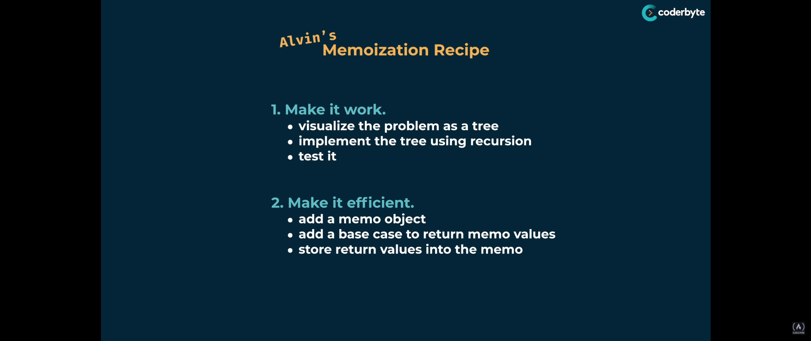

# Dynamic Programming

This is some helpful information I came across while watching the following video from freeCodeCamp and Coderbyte.  https://www.youtube.com/watch?v=oBt53YbR9Kk

## Alvin's Memoization Recipe
> [Learn more](https://www.youtube.com/watch?v=oBt53YbR9Kk&t=3892s)
